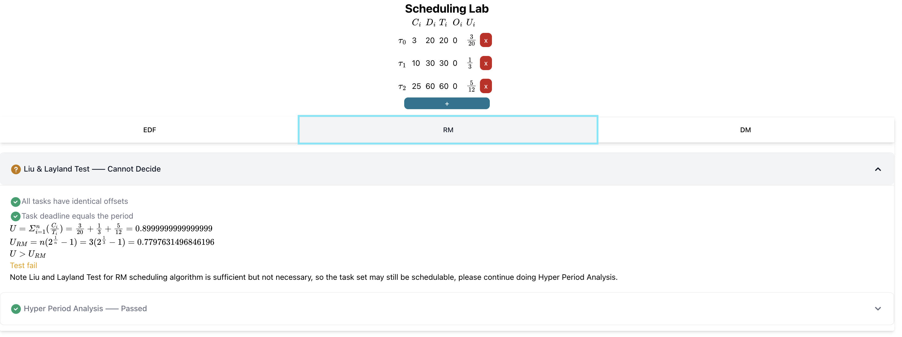

# Scheduling Lab

## What's this

This is a web tool I developed when studying EDA223 / DIT162, Real time systems in Chalmers University of Technology.

It can solve scheduling problems automatically.

## How to use

### Edit the task table

Click the `+` button to create a new task.

Click the `x` button to delete a new task.

Click a number to edit it.

Move your mouse on an abbreviation to show its meaning. (I can never remember them).

### View the result

You can visit result of different tests and analysis by clicking each scheduling algorithms' name.

## Find a bug? Need some feature?

Open an issue here or email the author at <longfangsong@icloud.com>.